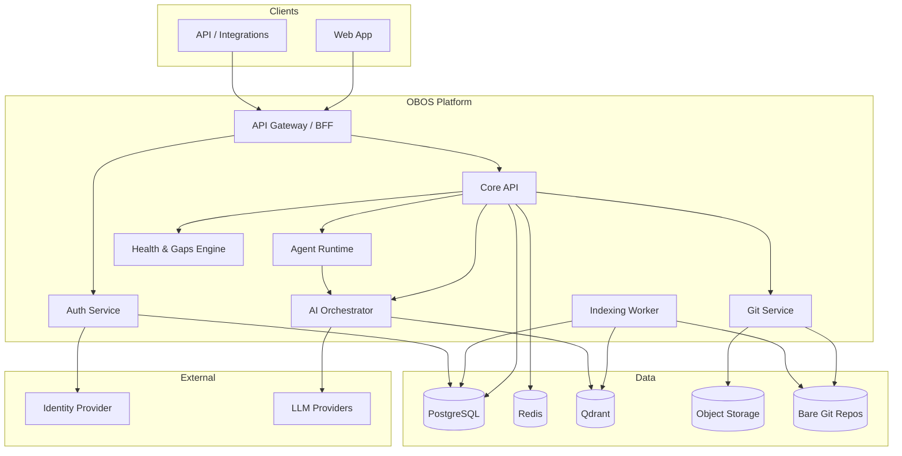
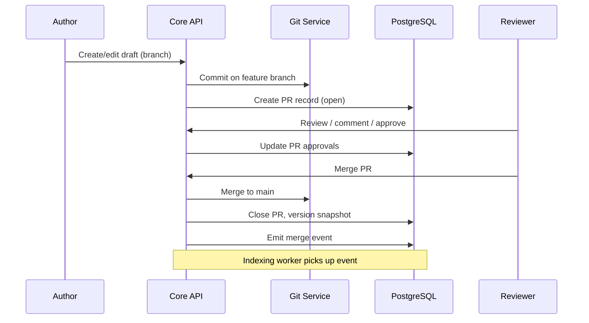
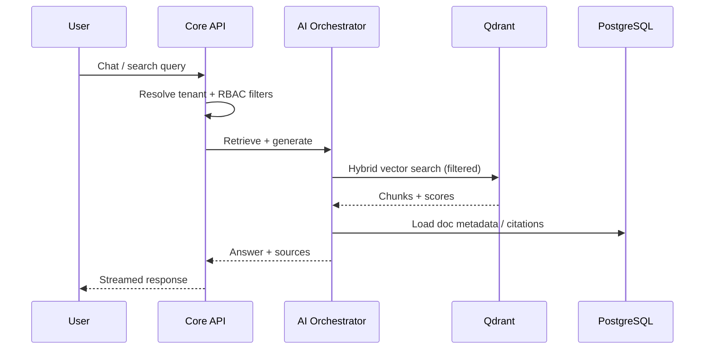
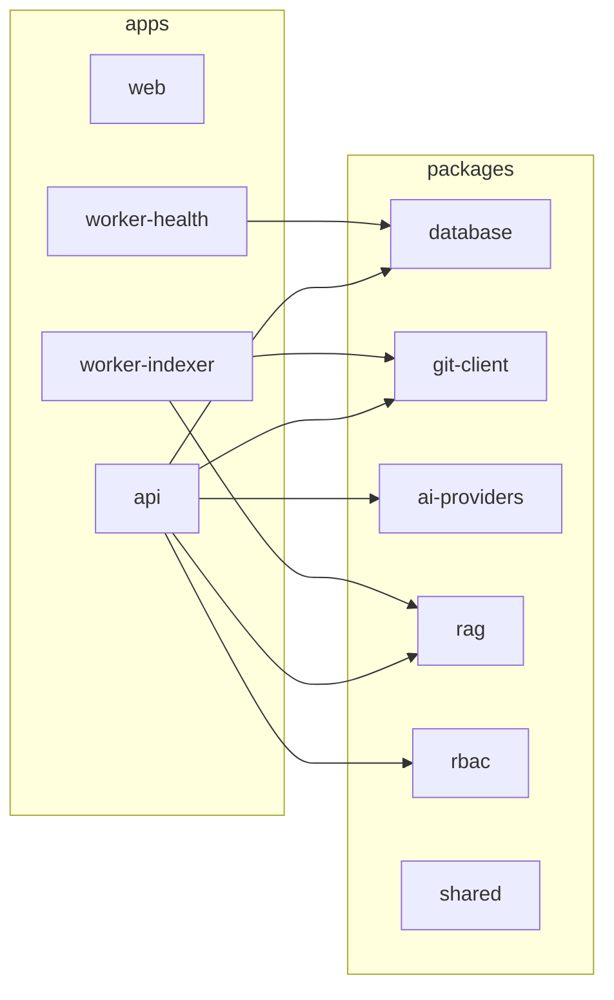
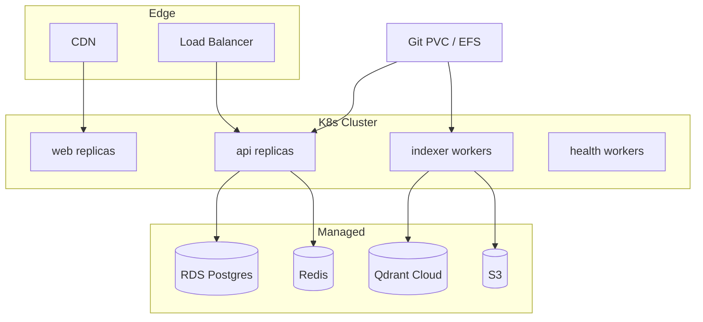

# 1. High-Level Architecture

## 1.1 System Context

Organizational Brain OS (OBOS) is a multi-tenant SaaS where each **organization** owns a Git-backed knowledge repository. Users collaborate through Markdown documents, propose changes via **pull requests**, and consume knowledge through **AI search**, **chat**, and **agents**. Vector embeddings live in **Qdrant**; operational metadata lives in **PostgreSQL**.

## 1.2 Logical Layers

| Layer | Responsibility |
|-------|----------------|
| **Presentation** | Next.js UI: knowledge browser, PR review, chat, admin, health dashboards |
| **API / BFF** | REST + WebSocket; tenant context injection; rate limiting |
| **Domain services** | Orgs, users, departments, RBAC, documents, PRs, audit, gaps, agents |
| **Git subsystem** | Clone/fetch/commit/merge; branch protection; diff rendering |
| **AI subsystem** | Embeddings, RAG retrieval, chat completion, tool use for agents |
| **Indexing pipeline** | Event-driven re-embed on merge; chunking; Qdrant upsert/delete |
| **Infrastructure** | Postgres, Redis queues, Qdrant, S3, observability |

## 1.3 Core Data Flows

### Knowledge write (approval path)

### Knowledge read (RAG path)

## 1.4 Multi-Tenancy Model

**Pool model with row-level security (RLS)** in PostgreSQL plus **hard namespace separation** in Git and Qdrant.

| Resource | Isolation strategy |
|----------|-------------------|
| PostgreSQL | `organization_id` on all tenant tables; RLS policies; connection `SET app.current_org` |
| Git | One bare repo per org: `git/orgs/{org_slug}.git` |
| Qdrant | Collection per org: `org_{org_id}_knowledge` |
| S3 | Prefix: `orgs/{org_id}/` |
| Redis keys | Prefix: `org:{org_id}:` |

**Super-admin** (platform) is separate from **org admin** (tenant).

## 1.5 Service Decomposition (Monorepo Packages)

## 1.6 Deployment Topology (Production)

- **Stateful Git**: persistent volume shared read-write-many (EFS) or Git remote (Gitea/Forgejo) for scale-out.
- **Workers** scale independently from API.
- **Secrets**: per-tenant LLM keys optional; platform default key with usage metering.

## 1.7 Event Bus (Internal)

Async domain events via Redis Streams or BullMQ:

| Event | Consumers |
|-------|-----------|
| `knowledge.merged` | Indexer, health scorer, webhook dispatcher |
| `knowledge.deleted` | Indexer (purge vectors) |
| `pr.opened` / `pr.merged` | Notifications, audit enricher |
| `gap.detected` | Notifications, dashboard cache |
| `agent.run.completed` | Audit, usage billing |

## 1.8 Non-Functional Requirements

| Concern | Target |
|---------|--------|
| Availability | 99.9% API; async indexing eventual (&lt; 2 min p95) |
| Latency | Search p95 &lt; 800ms; chat first token &lt; 2s |
| Security | SOC2-ready audit; encryption at rest + TLS |
| Compliance | Data residency per org (future: region-specific stacks) |
| Backup | Postgres PITR; Git bundle daily; Qdrant snapshots |

## 1.9 Key Architectural Decisions

| Decision | Rationale |
|----------|-----------|
| Git for content | Version history, diffs, familiar PR workflow, export portability |
| Postgres for metadata | ACID workflow state, RBAC, audit, relational reporting |
| Qdrant per org collection | Simple tenant purge; filter payload for department/doc ACL |
| Monorepo | Shared types, single Prisma schema, coordinated releases |
| Separate indexer workers | Embedding is CPU/API-heavy; must not block API |
| BFF in API app initially | Reduce premature microservice split |
