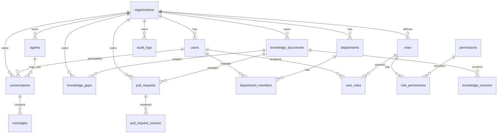

# 2. Database Design

## 2.1 Entity Relationship Overview



## 2.2 Conventions

- All tenant tables include `organization_id UUID NOT NULL`.
- Primary keys: `UUID` v7 (time-sortable) unless noted.
- Timestamps: `created_at`, `updated_at` (timestamptz UTC).
- Soft delete: `deleted_at` where user-facing recovery matters.
- Enums stored as Postgres enums or Prisma enums.

---

## 2.3 Table: `organizations`

| Column | Type | Notes |
|--------|------|-------|
| id | UUID PK | |
| slug | VARCHAR(63) UNIQUE | URL-safe identifier |
| name | VARCHAR(255) | Display name |
| plan | ENUM | free, team, enterprise |
| status | ENUM | active, suspended, trial |
| git_repo_path | TEXT | Path or remote URL to bare repo |
| settings | JSONB | Feature flags, default branch, LLM prefs |
| qdrant_collection | VARCHAR(128) | Cached collection name |
| created_at | TIMESTAMPTZ | |
| updated_at | TIMESTAMPTZ | |
| deleted_at | TIMESTAMPTZ | Soft delete |

**Indexes:** `slug`, `status`

---

## 2.4 Table: `users`

Platform user; membership to orgs via `organization_members`.

| Column | Type | Notes |
|--------|------|-------|
| id | UUID PK | |
| email | VARCHAR(255) UNIQUE | |
| email_verified_at | TIMESTAMPTZ | |
| password_hash | TEXT NULL | Null if SSO-only |
| name | VARCHAR(255) | |
| avatar_url | TEXT | |
| auth_provider | ENUM | local, oidc, saml |
| external_id | VARCHAR(255) | IdP subject |
| last_login_at | TIMESTAMPTZ | |
| created_at | TIMESTAMPTZ | |
| updated_at | TIMESTAMPTZ | |

---

## 2.5 Table: `organization_members`

| Column | Type | Notes |
|--------|------|-------|
| id | UUID PK | |
| organization_id | UUID FK | |
| user_id | UUID FK | |
| status | ENUM | invited, active, suspended |
| joined_at | TIMESTAMPTZ | |
| invited_by_id | UUID FK users | |

**Unique:** `(organization_id, user_id)`

---

## 2.6 Table: `departments`

Hierarchical org units.

| Column | Type | Notes |
|--------|------|-------|
| id | UUID PK | |
| organization_id | UUID FK | |
| parent_id | UUID FK NULL | Self-reference |
| name | VARCHAR(255) | |
| slug | VARCHAR(63) | Unique per org |
| description | TEXT | |
| path | LTREE or TEXT | Materialized path e.g. `/eng/backend` |
| created_at | TIMESTAMPTZ | |
| updated_at | TIMESTAMPTZ | |
| deleted_at | TIMESTAMPTZ | |

**Unique:** `(organization_id, slug)`

---

## 2.7 Table: `department_members`

| Column | Type | Notes |
|--------|------|-------|
| id | UUID PK | |
| department_id | UUID FK | |
| user_id | UUID FK | |
| is_lead | BOOLEAN | |
| created_at | TIMESTAMPTZ | |

**Unique:** `(department_id, user_id)`

---

## 2.8 Table: `roles`

Org-scoped role definitions (system + custom).

| Column | Type | Notes |
|--------|------|-------|
| id | UUID PK | |
| organization_id | UUID FK | |
| name | VARCHAR(100) | e.g. Admin, Editor, Viewer |
| slug | VARCHAR(63) | |
| description | TEXT | |
| is_system | BOOLEAN | Built-in roles not deletable |
| created_at | TIMESTAMPTZ | |
| updated_at | TIMESTAMPTZ | |

**Unique:** `(organization_id, slug)`

---

## 2.9 Table: `permissions`

Global permission catalog (not tenant-specific).

| Column | Type | Notes |
|--------|------|-------|
| id | UUID PK | |
| resource | VARCHAR(64) | knowledge, pr, user, agent, ... |
| action | VARCHAR(64) | create, read, update, delete, merge, ... |
| slug | VARCHAR(128) UNIQUE | e.g. `knowledge:merge` |
| description | TEXT | |

---

## 2.10 Table: `role_permissions`

| Column | Type | Notes |
|--------|------|-------|
| role_id | UUID FK | |
| permission_id | UUID FK | |

**PK:** `(role_id, permission_id)`

---

## 2.11 Table: `user_roles`

| Column | Type | Notes |
|--------|------|-------|
| id | UUID PK | |
| organization_id | UUID FK | |
| user_id | UUID FK | |
| role_id | UUID FK | |
| scope_department_id | UUID FK NULL | Optional dept-scoped role |
| granted_by_id | UUID FK | |
| created_at | TIMESTAMPTZ | |

**Indexes:** `(organization_id, user_id)`

---

## 2.12 Table: `knowledge_documents`

Metadata mirror of Git paths.

| Column | Type | Notes |
|--------|------|-------|
| id | UUID PK | |
| organization_id | UUID FK | |
| department_id | UUID FK NULL | Owning department |
| title | VARCHAR(500) | |
| slug | VARCHAR(255) | Unique per org |
| git_path | TEXT | e.g. `departments/eng/onboarding.md` |
| doc_type | ENUM | policy, runbook, faq, general |
| status | ENUM | draft, published, archived |
| current_version_id | UUID FK NULL | Latest merged version |
| health_score | DECIMAL(5,2) | 0–100 cached |
| health_updated_at | TIMESTAMPTZ | |
| owner_user_id | UUID FK | |
| tags | TEXT[] | |
| metadata | JSONB | Frontmatter cache |
| created_at | TIMESTAMPTZ | |
| updated_at | TIMESTAMPTZ | |
| deleted_at | TIMESTAMPTZ | |

**Unique:** `(organization_id, git_path)`, `(organization_id, slug)`

---

## 2.13 Table: `knowledge_versions`

Immutable snapshot per merge to main.

| Column | Type | Notes |
|--------|------|-------|
| id | UUID PK | |
| organization_id | UUID FK | |
| document_id | UUID FK | |
| version_number | INT | Monotonic per document |
| git_commit_sha | CHAR(40) | |
| content_hash | CHAR(64) | SHA-256 of normalized content |
| content_preview | TEXT | First N chars for UI |
| word_count | INT | |
| created_by_id | UUID FK | |
| pull_request_id | UUID FK NULL | |
| merged_at | TIMESTAMPTZ | |
| created_at | TIMESTAMPTZ | |

**Unique:** `(document_id, version_number)`

---

## 2.14 Table: `pull_requests`

Git-backed change proposals.

| Column | Type | Notes |
|--------|------|-------|
| id | UUID PK | |
| organization_id | UUID FK | |
| number | INT | Per-org sequence |
| title | VARCHAR(500) | |
| description | TEXT | |
| status | ENUM | draft, open, approved, changes_requested, merged, closed |
| source_branch | VARCHAR(255) | |
| target_branch | VARCHAR(255) | Usually `main` |
| author_id | UUID FK | |
| merged_by_id | UUID FK NULL | |
| merged_at | TIMESTAMPTZ NULL | |
| closed_at | TIMESTAMPTZ NULL | |
| git_merge_commit_sha | CHAR(40) NULL | |
| required_approvals | INT | |
| created_at | TIMESTAMPTZ | |
| updated_at | TIMESTAMPTZ | |

**Unique:** `(organization_id, number)`

---

## 2.15 Table: `pull_request_files`

| Column | Type | Notes |
|--------|------|-------|
| id | UUID PK | |
| pull_request_id | UUID FK | |
| document_id | UUID FK NULL | |
| git_path | TEXT | |
| change_type | ENUM | added, modified, deleted, renamed |
| additions | INT | |
| deletions | INT | |

---

## 2.16 Table: `pull_request_reviews`

| Column | Type | Notes |
|--------|------|-------|
| id | UUID PK | |
| pull_request_id | UUID FK | |
| reviewer_id | UUID FK | |
| state | ENUM | pending, approved, changes_requested, commented |
| body | TEXT | |
| created_at | TIMESTAMPTZ | |
| updated_at | TIMESTAMPTZ | |

**Unique:** `(pull_request_id, reviewer_id)` — one active review per reviewer (updates in place)

---

## 2.17 Table: `audit_logs`

Append-only compliance trail.

| Column | Type | Notes |
|--------|------|-------|
| id | UUID PK | |
| organization_id | UUID FK | |
| actor_user_id | UUID FK NULL | Null for system |
| actor_type | ENUM | user, system, agent |
| action | VARCHAR(128) | e.g. `pr.merged`, `document.read` |
| resource_type | VARCHAR(64) | |
| resource_id | UUID | |
| ip_address | INET | |
| user_agent | TEXT | |
| metadata | JSONB | Before/after, request id |
| created_at | TIMESTAMPTZ | |

**Indexes:** `(organization_id, created_at DESC)`, `(resource_type, resource_id)`

**Partitioning (scale):** monthly range on `created_at`

---

## 2.18 Table: `knowledge_gaps`

Detected missing or stale knowledge.

| Column | Type | Notes |
|--------|------|-------|
| id | UUID PK | |
| organization_id | UUID FK | |
| department_id | UUID FK NULL | |
| document_id | UUID FK NULL | Related doc if any |
| gap_type | ENUM | missing_topic, stale, broken_link, low_coverage, unanswered_query |
| title | VARCHAR(500) | |
| description | TEXT | |
| severity | ENUM | low, medium, high, critical |
| status | ENUM | open, acknowledged, in_progress, resolved, dismissed |
| evidence | JSONB | Queries, links, scores |
| detected_by | ENUM | system, agent, user |
| assigned_to_id | UUID FK NULL | |
| resolved_at | TIMESTAMPTZ NULL | |
| created_at | TIMESTAMPTZ | |
| updated_at | TIMESTAMPTZ | |

---

## 2.19 Table: `knowledge_health_scores`

Time-series health per document (optional; can also cache on document).

| Column | Type | Notes |
|--------|------|-------|
| id | UUID PK | |
| organization_id | UUID FK | |
| document_id | UUID FK | |
| score | DECIMAL(5,2) | |
| dimensions | JSONB | freshness, completeness, usage, review_age |
| computed_at | TIMESTAMPTZ | |

**Index:** `(document_id, computed_at DESC)`

---

## 2.20 Table: `agents`

Configurable AI agents per org.

| Column | Type | Notes |
|--------|------|-------|
| id | UUID PK | |
| organization_id | UUID FK | |
| name | VARCHAR(255) | |
| slug | VARCHAR(63) | |
| description | TEXT | |
| system_prompt | TEXT | |
| model_config | JSONB | provider, model, temperature |
| tools_enabled | TEXT[] | search, read_doc, create_pr, ... |
| department_scope_id | UUID FK NULL | Limit retrieval |
| status | ENUM | active, disabled |
| created_by_id | UUID FK | |
| created_at | TIMESTAMPTZ | |
| updated_at | TIMESTAMPTZ | |

---

## 2.21 Table: `conversations`

Chat sessions (user or agent-initiated).

| Column | Type | Notes |
|--------|------|-------|
| id | UUID PK | |
| organization_id | UUID FK | |
| user_id | UUID FK | |
| agent_id | UUID FK NULL | |
| title | VARCHAR(500) | Auto-generated |
| context_type | ENUM | general, document, pr, gap |
| context_id | UUID NULL | Linked resource |
| status | ENUM | active, archived |
| metadata | JSONB | Retrieval filters used |
| created_at | TIMESTAMPTZ | |
| updated_at | TIMESTAMPTZ | |

---

## 2.22 Table: `messages`

| Column | Type | Notes |
|--------|------|-------|
| id | UUID PK | |
| conversation_id | UUID FK | |
| organization_id | UUID FK | Denormalized for RLS |
| role | ENUM | user, assistant, system, tool |
| content | TEXT | |
| citations | JSONB | [{documentId, chunkId, score}] |
| token_usage | JSONB | prompt, completion counts |
| model_used | VARCHAR(64) | |
| created_at | TIMESTAMPTZ | |

**Index:** `(conversation_id, created_at)`

---

## 2.23 Supporting Tables

### `api_keys` (integrations)

| Column | Type |
|--------|------|
| id, organization_id, name, key_hash, scopes[], expires_at, created_by_id, last_used_at |

### `webhooks`

| Column | Type |
|--------|------|
| id, organization_id, url, events[], secret, status |

### `indexing_jobs`

| Column | Type |
|--------|------|
| id, organization_id, document_id, commit_sha, status, error, started_at, completed_at |

### `organization_llm_config`

| Column | Type |
|--------|------|
| id, organization_id, provider, api_key_encrypted, default_model, embedding_model |

---

## 2.24 Row-Level Security (PostgreSQL)

```sql
-- Example policy pattern
ALTER TABLE knowledge_documents ENABLE ROW LEVEL SECURITY;

CREATE POLICY tenant_isolation ON knowledge_documents
  USING (organization_id = current_setting('app.current_org_id')::uuid);
```

Application sets `app.current_org_id` per request after JWT validation.

---

## 2.25 Indexing Strategy Summary

| Table | Critical indexes |
|-------|------------------|
| knowledge_documents | `(organization_id, status)`, `(department_id)`, GIN on `tags` |
| pull_requests | `(organization_id, status)`, `(author_id)` |
| audit_logs | `(organization_id, created_at DESC)` |
| messages | `(conversation_id, created_at)` |
| knowledge_gaps | `(organization_id, status, severity)` |
