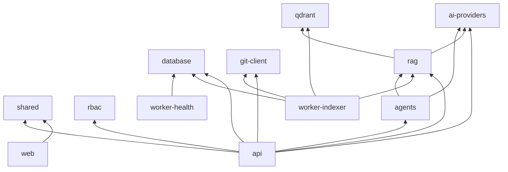

# 4. Monorepo Folder Structure

Turborepo + pnpm workspaces. TypeScript throughout.

```
organizational-brain/
├── .github/
│   └── workflows/
│       ├── ci.yml
│       ├── deploy-api.yml
│       └── deploy-web.yml
├── apps/
│   ├── web/                          # Next.js 15 frontend
│   │   ├── app/
│   │   │   ├── (auth)/
│   │   │   │   ├── login/
│   │   │   │   └── invite/
│   │   │   ├── (dashboard)/
│   │   │   │   └── [orgSlug]/
│   │   │   │       ├── knowledge/
│   │   │   │       ├── pull-requests/
│   │   │   │       ├── chat/
│   │   │   │       ├── agents/
│   │   │   │       ├── health/
│   │   │   │       ├── gaps/
│   │   │   │       ├── departments/
│   │   │   │       ├── members/
│   │   │   │       └── settings/
│   │   │   ├── api/                  # Route handlers (BFF proxies if needed)
│   │   │   └── layout.tsx
│   │   ├── components/
│   │   │   ├── knowledge/
│   │   │   ├── pull-requests/
│   │   │   ├── chat/
│   │   │   └── ui/
│   │   ├── hooks/
│   │   ├── lib/
│   │   └── package.json
│   │
│   ├── api/                          # Main REST + WebSocket server
│   │   ├── src/
│   │   │   ├── main.ts
│   │   │   ├── config/
│   │   │   ├── modules/
│   │   │   │   ├── auth/
│   │   │   │   ├── organizations/
│   │   │   │   ├── users/
│   │   │   │   ├── departments/
│   │   │   │   ├── rbac/
│   │   │   │   ├── knowledge/
│   │   │   │   ├── pull-requests/
│   │   │   │   ├── git/
│   │   │   │   ├── search/
│   │   │   │   ├── chat/
│   │   │   │   ├── agents/
│   │   │   │   ├── health/
│   │   │   │   ├── gaps/
│   │   │   │   └── audit/
│   │   │   ├── middleware/
│   │   │   │   ├── tenant-context.ts
│   │   │   │   ├── auth-guard.ts
│   │   │   │   └── audit-emitter.ts
│   │   │   └── common/
│   │   └── package.json
│   │
│   ├── worker-indexer/               # Qdrant embedding pipeline
│   │   ├── src/
│   │   │   ├── main.ts
│   │   │   ├── processors/
│   │   │   │   └── knowledge-merged.processor.ts
│   │   │   └── chunking/
│   │   └── package.json
│   │
│   └── worker-health/                # Health scores & gap detection
│       ├── src/
│       │   ├── main.ts
│       │   ├── scorers/
│       │   └── detectors/
│       └── package.json
│
├── packages/
│   ├── database/
│   │   ├── prisma/
│   │   │   ├── schema.prisma
│   │   │   ├── migrations/
│   │   │   └── seed.ts
│   │   ├── src/
│   │   │   └── index.ts              # Prisma client export
│   │   └── package.json
│   │
│   ├── shared/
│   │   ├── src/
│   │   │   ├── types/
│   │   │   ├── constants/
│   │   │   ├── errors/
│   │   │   └── utils/
│   │   └── package.json
│   │
│   ├── rbac/
│   │   ├── src/
│   │   │   ├── permissions.ts        # Permission catalog
│   │   │   ├── checker.ts
│   │   │   └── default-roles.ts
│   │   └── package.json
│   │
│   ├── git-client/
│   │   ├── src/
│   │   │   ├── repository.ts
│   │   │   ├── branch.ts
│   │   │   ├── commit.ts
│   │   │   ├── merge.ts
│   │   │   └── diff.ts
│   │   └── package.json
│   │
│   ├── ai-providers/
│   │   ├── src/
│   │   │   ├── types.ts
│   │   │   ├── factory.ts
│   │   │   ├── openai/
│   │   │   ├── anthropic/
│   │   │   └── gemini/
│   │   └── package.json
│   │
│   ├── rag/
│   │   ├── src/
│   │   │   ├── chunker.ts
│   │   │   ├── embedder.ts
│   │   │   ├── retriever.ts
│   │   │   ├── reranker.ts
│   │   │   └── pipeline.ts
│   │   └── package.json
│   │
│   ├── qdrant/
│   │   ├── src/
│   │   │   ├── client.ts
│   │   │   ├── collections.ts
│   │   │   └── payloads.ts
│   │   └── package.json
│   │
│   ├── agents/
│   │   ├── src/
│   │   │   ├── runtime.ts
│   │   │   ├── tools/
│   │   │   └── memory.ts
│   │   └── package.json
│   │
│   └── eslint-config/
│       └── package.json
│
├── infrastructure/
│   ├── docker/
│   │   ├── docker-compose.yml        # Postgres, Redis, Qdrant, MinIO
│   │   ├── Dockerfile.api
│   │   └── Dockerfile.web
│   ├── k8s/
│   │   ├── base/
│   │   └── overlays/
│   └── terraform/                    # Optional cloud IaC
│
├── docs/                             # Architecture (this folder)
│   ├── README.md
│   ├── 01-high-level-architecture.md
│   └── ...
│
├── scripts/
│   ├── dev.sh
│   ├── seed-permissions.ts
│   └── create-org-repo.ts
│
├── .env.example
├── turbo.json
├── pnpm-workspace.yaml
├── package.json
└── README.md
```

## Package Dependency Graph



## Boundary Rules

| Package | May import | Must not import |
|---------|------------|-----------------|
| `apps/api` | all packages | — |
| `apps/web` | `shared` only | server secrets, Prisma direct |
| `packages/rag` | `ai-providers`, `qdrant` | `apps/*` |
| `packages/git-client` | `shared` | DB, AI |
