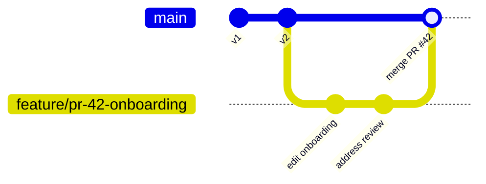
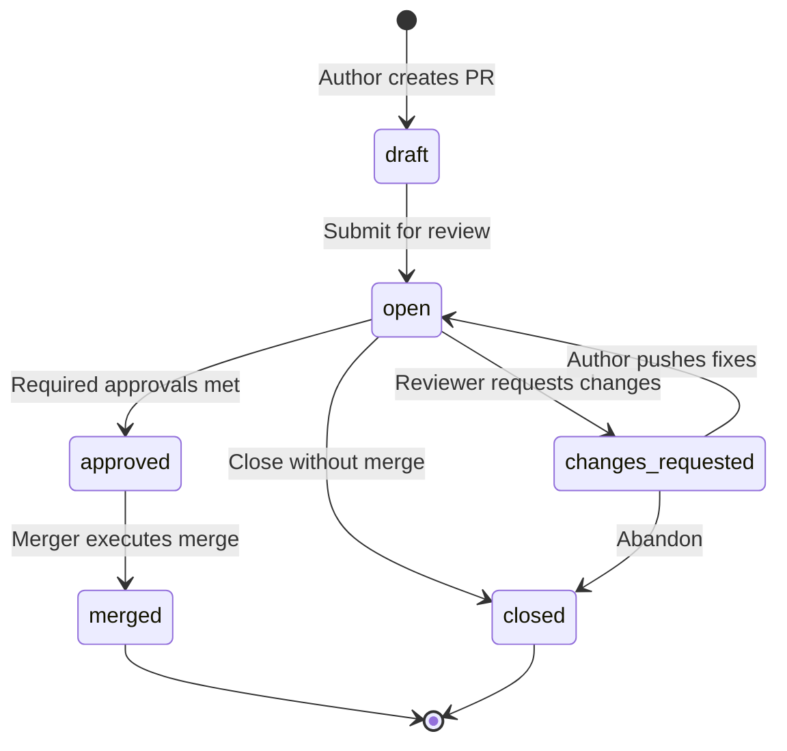

# 6. Git Workflow — Knowledge Approval

## 6.1 Repository Layout (Per Organization)

Each org has one bare repository. Default branch: `main` (protected).

```
/
├── README.md
├── departments/
│   ├── engineering/
│   │   ├── onboarding.md
│   │   └── runbooks/
│   │       └── deploy.md
│   ├── hr/
│   │   └── policies/
│   │       └── pto.md
│   └── ...
├── company/
│   └── handbook.md
└── .obos/
    └── config.yml          # Optional org-level git config
```

**Path rules**

- `git_path` in DB mirrors repo path exactly.
- Department slug maps to `departments/{slug}/`.
- Frontmatter (YAML) in Markdown is parsed for `title`, `tags`, `owner`, `reviewers`.

---

## 6.2 Branching Model



| Branch type | Pattern | Lifetime |
|-------------|---------|----------|
| Protected default | `main` | Permanent |
| Knowledge PR | `pr/{number}-{slug}` | Deleted after merge (optional) |
| User draft | `draft/{userId}/{docSlug}` | GC after 30d inactive |

---

## 6.3 Pull Request Lifecycle



### State machine rules

| Transition | Preconditions |
|------------|---------------|
| draft → open | At least one commit; author has `pr:create` |
| open → approved | `approval_count >= required_approvals`; no blocking `changes_requested` |
| approved → merged | Actor has `pr:merge`; clean merge (or allowed squash) |
| * → closed | Author or `pr:close` permission |

**Required approvals** default from org settings (e.g. 1 for team, 2 for policy docs).

**CODEOWNERS** (phase 2): `.obos/CODEOWNERS` maps paths → required reviewer roles.

---

## 6.4 Write Operations

### Create new document

1. API creates `knowledge_documents` row (status: `draft`).
2. Git: branch `draft/{userId}/{slug}` or direct PR branch.
3. Commit new file at `departments/{dept}/{slug}.md`.
4. Open PR targeting `main`.

### Edit existing document

1. Checkout PR branch from `main`.
2. Commit Markdown changes.
3. `pull_request_files` populated via diff against `main`.

### Delete document

1. PR removes file from Git.
2. On merge: document `status → archived`, vectors purged.

---

## 6.5 Merge Strategies

| Strategy | Default | Use case |
|----------|---------|----------|
| Merge commit | Yes | Preserves branch history |
| Squash merge | Optional per org | Clean main history |
| Rebase merge | Off by default | Advanced users |

Post-merge hooks (application level):

1. Update `knowledge_versions` with `git_commit_sha`.
2. Set `current_version_id` on document; `status → published`.
3. Emit `knowledge.merged` event → indexer.
4. Write `audit_logs` entry.

---

## 6.6 Conflict Handling

When `main` advances during review:

1. API detects non-fast-forward on merge attempt.
2. Response `409 Conflict` with `behind_commits` count.
3. Author actions:
   - **Rebase** PR branch onto `main` (preferred), or
   - **Merge** `main` into PR branch.
4. Re-run diff; re-request review if org policy `re_review_on_conflict`.

---

## 6.7 Review & Comments

- Reviews stored in `pull_request_reviews` (state + body).
- Inline comments (phase 2): store line-level anchors in JSON metadata linked to commit SHA.
- AI review assistant (phase 3): optional bot comment as `actor_type: agent`.

---

## 6.8 Git ↔ Database Sync

| Git event | DB action |
|-----------|-----------|
| PR opened | Insert `pull_requests`, scan diff → `pull_request_files` |
| New commit on PR branch | Refresh files/diff stats |
| Merge | Close PR, create `knowledge_versions`, update documents |
| Direct push to main | **Blocked** — only merge via PR (hook enforcement) |

**Sync worker** (reconciliation): nightly job compares `main` tree to DB; flags drift.

---

## 6.9 Permissions Mapping

| Git action | Permission |
|------------|------------|
| Create branch / commit on PR branch | `knowledge:update` |
| Open PR | `pr:create` |
| Approve | `pr:review` |
| Merge | `pr:merge` |
| Push to `main` | **Denied** (service account only at merge) |

Merge executed by **Git Service** using org-scoped service identity, not user credentials.

---

## 6.10 Export & Portability

- `GET /organizations/{orgId}/export` → Git bundle (`.git` archive).
- Supports customer offboarding and disaster recovery.
- Markdown files remain human-readable without OBOS.
