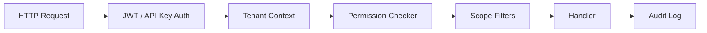
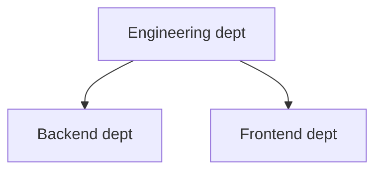

# 7. Security Model — RBAC & Tenancy

## 7.1 Authorization Overview



**Fail closed**: missing permission → `403`; invalid tenant → `404` (no enumeration).

---

## 7.2 Role Hierarchy (System Roles)

Seeded per organization on creation.

| Role | Slug | Intent |
|------|------|--------|
| Organization Admin | `admin` | Full org control |
| Knowledge Manager | `knowledge_manager` | CRUD + merge PRs |
| Editor | `editor` | Create/edit, open PRs |
| Reviewer | `reviewer` | Approve PRs, no direct publish |
| Viewer | `viewer` | Read + search + chat |
| Agent Operator | `agent_operator` | Run agents, read knowledge |
| Auditor | `auditor` | Read-only + audit export |

Custom roles: org admin composes from permission catalog.

---

## 7.3 Permission Catalog

Format: `{resource}:{action}`

### Organization

| Permission | Actions |
|------------|---------|
| `org:read` | View org profile |
| `org:update` | Settings, LLM config |
| `org:delete` | Soft-delete org |

### Members

| Permission | Actions |
|------------|---------|
| `member:read` | List members |
| `member:invite` | Invite users |
| `member:update` | Change member status |
| `member:remove` | Remove member |

### Departments

| Permission | Actions |
|------------|---------|
| `department:read` | View tree |
| `department:create` | Create dept |
| `department:update` | Edit dept |
| `department:delete` | Delete dept |
| `department:manage_members` | Add/remove dept members |

### Knowledge

| Permission | Actions |
|------------|---------|
| `knowledge:read` | View docs, content, versions |
| `knowledge:create` | Create docs |
| `knowledge:update` | Edit drafts / PR branches |
| `knowledge:delete` | Archive/delete |

### Pull requests

| Permission | Actions |
|------------|---------|
| `pr:read` | View PRs, diffs |
| `pr:create` | Open PR |
| `pr:update` | Edit own PR metadata |
| `pr:review` | Approve / request changes |
| `pr:merge` | Merge to main |
| `pr:close` | Close PR |

### Chat & agents

| Permission | Actions |
|------------|---------|
| `chat:read` | View conversations |
| `chat:create` | Send messages |
| `chat:delete` | Delete own conversations |
| `agent:read` | View agent configs |
| `agent:create` | Create agents |
| `agent:update` | Edit agents |
| `agent:delete` | Delete agents |
| `agent:execute` | Run agents |

### Health & gaps

| Permission | Actions |
|------------|---------|
| `health:read` | View scores |
| `health:manage` | Trigger recompute |
| `gap:read` | View gaps |
| `gap:update` | Assign, dismiss |
| `gap:resolve` | Mark resolved |

### Admin & compliance

| Permission | Actions |
|------------|---------|
| `role:read` | View roles |
| `role:create` | Custom roles |
| `role:update` | Edit role permissions |
| `role:delete` | Delete custom roles |
| `role:assign` | Assign roles to users |
| `audit:read` | View audit logs |
| `audit:export` | Export CSV/JSON |
| `api_key:*` | Manage API keys |
| `webhook:*` | Manage webhooks |

---

## 7.4 Default Role → Permission Matrix

| Permission | admin | knowledge_manager | editor | reviewer | viewer | agent_operator | auditor |
|------------|:-----:|:-----------------:|:------:|:--------:|:------:|:--------------:|:-------:|
| org:update | ✓ | | | | | | |
| member:* | ✓ | | | | | | |
| department:* | ✓ | ✓ | | | | | |
| knowledge:read | ✓ | ✓ | ✓ | ✓ | ✓ | ✓ | ✓ |
| knowledge:create | ✓ | ✓ | ✓ | | | | |
| knowledge:update | ✓ | ✓ | ✓ | | | | |
| knowledge:delete | ✓ | ✓ | | | | | |
| pr:merge | ✓ | ✓ | | | | | |
| pr:review | ✓ | ✓ | | ✓ | | | |
| pr:create | ✓ | ✓ | ✓ | | | | |
| chat:create | ✓ | ✓ | ✓ | ✓ | ✓ | ✓ | |
| agent:execute | ✓ | ✓ | | | | ✓ | |
| audit:read | ✓ | | | | | | ✓ |
| health:* | ✓ | ✓ | | | ✓ | | ✓ |
| gap:* | ✓ | ✓ | ✓ | | | | ✓ |

---

## 7.5 Department-Scoped Roles

`user_roles.scope_department_id` limits permissions to a subtree:



User with `editor` scoped to `Engineering`:

- May edit docs where `department.path` starts with `/engineering`.
- Retrieval filters include sibling departments only if also granted.

**Evaluation order**

1. Collect all roles for user in org.
2. For each permission check, if any role grants it (global or scoped match), allow.
3. Apply document-level denials (future: explicit ACL table).

---

## 7.6 ABAC Filters (Retrieval & AI)

Even with `knowledge:read`, vector search applies payload filters:

```json
{
  "must": [
    { "key": "organization_id", "match": { "value": "..." } },
    { "should": [
      { "key": "department_id", "match": { "any": ["allowed-dept-ids"] } },
      { "key": "visibility", "match": { "value": "org_wide" } }
    ]}
  ]
}
```

Document frontmatter `visibility: department|org` controls Qdrant payload.

---

## 7.7 Authentication

| Mechanism | Details |
|-----------|---------|
| JWT access token | 15 min TTL; claims: `sub`, `email`, `org_id` (active org) |
| Refresh token | HttpOnly cookie; rotation on use |
| API keys | Scoped subset of permissions; stored as bcrypt hash |
| SSO | OIDC / SAML for enterprise |

**MFA** (phase 2): TOTP/WebAuthn for admin roles.

---

## 7.8 Data Protection

| Layer | Control |
|-------|---------|
| Transit | TLS 1.2+ everywhere |
| At rest | Postgres TDE; S3 SSE; encrypted LLM API keys (KMS) |
| Secrets | Vault / cloud KMS; never in Git |
| PII | Email in users table; redact in audit export option |
| Tenant isolation | RLS + separate Git repo + Qdrant collection |

---

## 7.9 Audit Requirements

All mutations log:

- `actor_user_id`, `actor_type`, `action`, `resource_type`, `resource_id`
- `ip_address`, `user_agent`, `metadata` (diff summary, PR number)

**Immutable**: no UPDATE/DELETE on `audit_logs` (append-only).

Sensitive reads (optional phase 2): `document.read` for compliance mode.

---

## 7.10 Agent Security

| Control | Implementation |
|---------|----------------|
| Tool allowlist | `agents.tools_enabled` intersect platform catalog |
| Permission ceiling | Agent runs as invoking user permissions |
| No privilege escalation | Agents cannot assign roles or merge without user permission |
| Prompt injection mitigation | Retrieved content wrapped; cite sources |
| Rate limits | Per-org agent run quota |

---

## 7.11 Threat Model (Summary)

| Threat | Mitigation |
|--------|------------|
| Cross-tenant data leak | RLS, collection isolation, mandatory org filter in Qdrant |
| Unauthorized merge | `pr:merge` + approval count + protected branch |
| API key theft | Hashing, scopes, expiry, rotation |
| LLM data exfiltration | Retrieval scoped; no training on customer data (provider BAAs) |
| Git injection | Path validation; no `..` in paths; sandboxed git ops |
