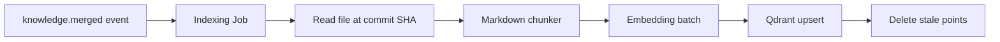
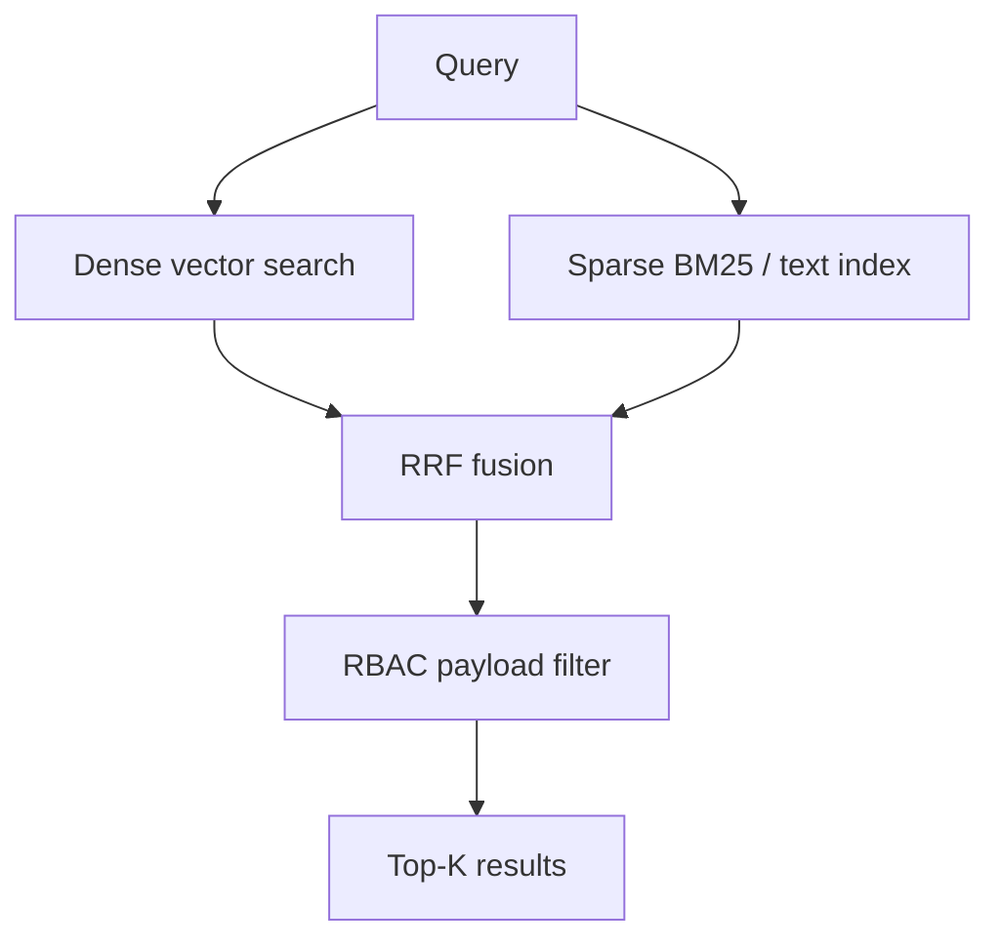

# 9. Qdrant Architecture

## 9.1 Collection Strategy

**One collection per organization** — simplifies isolation, backup, and deletion.

| Property | Value |
|----------|-------|
| Collection name | `org_{organization_id}_knowledge` |
| Vector size | 1536 (default; configurable per org embedding model) |
| Distance | Cosine |
| Replication | Qdrant cluster (production) |

On org creation: provision collection via `collections.create`. Store name in `organizations.qdrant_collection`.

---

## 9.2 Point Structure

Each **chunk** is one point.

```json
{
  "id": "uuid-v7",
  "vector": [0.012, "..."],
  "payload": {
    "organization_id": "uuid",
    "document_id": "uuid",
    "version_id": "uuid",
    "department_id": "uuid | null",
    "git_path": "departments/eng/onboarding.md",
    "chunk_index": 3,
    "heading_path": ["Onboarding", "Setup"],
    "content": "chunk text for display/snippet",
    "content_hash": "sha256",
    "doc_type": "runbook",
    "tags": ["eng", "onboarding"],
    "visibility": "org_wide | department",
    "status": "published",
    "merged_at": "2026-06-01T12:00:00Z",
    "token_count": 412
  }
}
```

**Point ID**: deterministic `hash(org_id + document_id + version_id + chunk_index)` for idempotent upserts.

---

## 9.3 Indexing Pipeline



### Steps

1. Worker receives `{ orgId, documentId, commitSha, versionId }`.
2. Load Markdown from Git at `commitSha`.
3. Chunk → batch embed (size 32–64 texts per API call).
4. **Upsert** points with new `version_id`.
5. **Delete** points where `document_id` matches and `version_id` ≠ current (previous version cleanup).
6. On document delete: `delete` filter `document_id = X`.
7. Update `indexing_jobs.status = completed`.

### Backfill

- New org: full tree walk on `main`.
- Re-embed model change: org-level `reindex` command — delete collection vectors, replay all published versions.

---

## 9.4 Payload Indexes

```json
{
  "field_name": "organization_id",
  "field_schema": "keyword"
},
{
  "field_name": "document_id",
  "field_schema": "keyword"
},
{
  "field_name": "department_id",
  "field_schema": "keyword"
},
{
  "field_name": "tags",
  "field_schema": "keyword"
},
{
  "field_name": "status",
  "field_schema": "keyword"
},
{
  "field_name": "merged_at",
  "field_schema": "datetime"
}
```

Enables fast pre-filtering before vector search.

---

## 9.5 Retrieval Strategy

### Hybrid search (recommended default)



| Mode | When |
|------|------|
| Dense only | Short conceptual queries |
| Sparse only | Exact phrase, error codes, acronyms |
| Hybrid | Default for chat and search API |

**Qdrant 1.10+**: use named vectors `dense` + sparse vector from same query if supported; else sparse via payload text index + RRF in application layer.

### Search parameters

| Parameter | Default |
|-----------|---------|
| `limit` (retrieve) | 20 |
| `score_threshold` | 0.65 (tune per org) |
| `hnsw_ef` | 128 |
| After rerank | Return top 5–8 to LLM |

### RBAC filter (mandatory)

```json
{
  "must": [
    { "key": "organization_id", "match": { "value": "{orgId}" } },
    { "key": "status", "match": { "value": "published" } }
  ],
  "should": [
    { "key": "visibility", "match": { "value": "org_wide" } },
    { "key": "department_id", "match": { "any": ["{allowedDeptIds}"] } }
  ]
}
```

---

## 9.6 Versioning & Consistency

| Scenario | Action |
|----------|--------|
| PR open (not merged) | **No index update** — only `main` is indexed |
| Merge to main | Index new version; delete old version points |
| Rollback (revert commit) | Treat as new merge event; re-index |
| Drift detected | Reconciliation job re-embeds document |

**Eventual consistency**: target p95 &lt; 2 minutes merge → searchable.

---

## 9.7 Multi-Tenant Operations

| Operation | Scope |
|-----------|-------|
| Create org | Create collection |
| Delete org | Drop collection + delete Git + Postgres cascade |
| Clone org (sandbox) | Copy collection with new org prefix |
| Metrics | Per-collection point count, segment size |

---

## 9.8 Capacity Planning

| Scale | Points (est.) | Notes |
|-------|---------------|-------|
| Small org | 10k | ~500 docs × 20 chunks |
| Medium org | 500k | |
| Large org | 5M+ | Consider sharding by department (phase 3) |

**Sharding evolution**: `org_{id}_dept_{dept_id}` when single collection &gt; 10M points.

---

## 9.9 Backup & DR

- Qdrant snapshots scheduled daily per collection.
- Store snapshot metadata in Postgres.
- DR restore: collection restore + verify `content_hash` sample against Git.

---

## 9.10 Development Environment

`docker-compose` Qdrant single node:

```yaml
# Reference — see infrastructure/docker/docker-compose.yml (phase 1)
qdrant:
  image: qdrant/qdrant:latest
  ports:
    - "6333:6333"
```

Use separate collection prefix `dev_` for local orgs.
