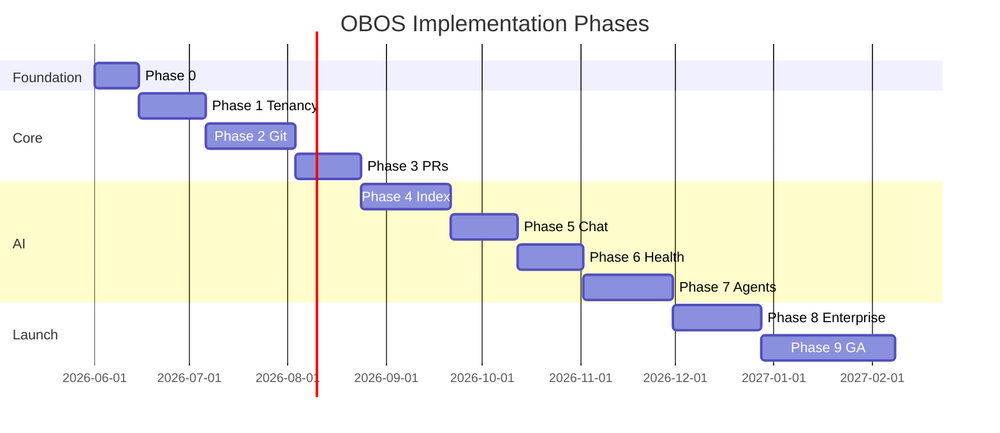

# 10. Development Roadmap

Phased delivery over ~9–12 months for a production-ready v1. Each phase ends with a demoable milestone.

---

## Phase 0 — Foundation (Weeks 1–2)

**Goal**: Runnable monorepo skeleton, CI, local infra.

| Deliverable | Details |
|-------------|---------|
| Monorepo bootstrap | Turborepo, pnpm, ESLint, shared tsconfig |
| Docker Compose | Postgres, Redis, Qdrant, MinIO |
| Prisma migrate | Initial schema from `schema.prisma` |
| API shell | Health check, OpenAPI stub |
| Web shell | Next.js auth layout placeholder |
| CI | Lint, typecheck, test on PR |

**Exit criteria**: `pnpm dev` starts all services; migration applies cleanly.

---

## Phase 1 — Tenancy & Identity (Weeks 3–5)

**Goal**: Multi-tenant orgs, users, auth.

| Deliverable | Details |
|-------------|---------|
| Auth | Register, login, JWT, refresh |
| Organizations CRUD | Create org, invite members |
| Organization context | Middleware `app.current_org_id` + RLS |
| Departments | Tree CRUD, members |
| RBAC seed | Permissions catalog, default roles |
| Audit log (basic) | Login, org create, member invite |

**Exit criteria**: Two isolated orgs; user cannot access other org data.

---

## Phase 2 — Git & Knowledge Core (Weeks 6–9)

**Goal**: Markdown in Git with metadata in Postgres.

| Deliverable | Details |
|-------------|---------|
| Git service | Bare repo per org; branch/commit/read |
| Knowledge documents API | CRUD metadata + content read |
| Draft branches | User edit flow |
| Document versioning | Snapshot on merge (prep) |
| Web: knowledge browser | List, view Markdown, edit |

**Exit criteria**: Create and view Markdown files backed by real Git commits.

---

## Phase 3 — Approval Workflow (Weeks 10–12)

**Goal**: PR-based publishing.

| Deliverable | Details |
|-------------|---------|
| Pull requests API | Open, review, merge, close |
| Protected `main` | No direct pushes |
| Diff rendering | File list + unified diff |
| Required approvals | Configurable per org |
| Web: PR UI | Review, approve, merge |
| Audit | PR lifecycle events |

**Exit criteria**: Editor proposes change → reviewer approves → merged to `main` → new version row.

---

## Phase 4 — Indexing & Search (Weeks 13–16)

**Goal**: Qdrant-powered retrieval.

| Deliverable | Details |
|-------------|---------|
| Indexer worker | `knowledge.merged` consumer |
| Chunking + embedding | Markdown-aware pipeline |
| Qdrant integration | Collection per org, upsert/delete |
| Search API | Semantic + hybrid |
| Web: search UI | Results with snippets |

**Exit criteria**: Merged doc searchable within 2 minutes; tenant-isolated results.

---

## Phase 5 — AI Chat (Weeks 17–19)

**Goal**: RAG chat with citations.

| Deliverable | Details |
|-------------|---------|
| Provider abstraction | OpenAI, Anthropic, Gemini adapters |
| Org LLM config | Encrypted API keys |
| Conversations + messages API | Persist history |
| RAG pipeline | Retrieve → generate → cite |
| WebSocket streaming | Token streaming |
| Web: chat UI | Source links to docs |

**Exit criteria**: User asks question; answer cites real org documents only.

---

## Phase 6 — Health & Gaps (Weeks 20–22)

**Goal**: Knowledge quality visibility.

| Deliverable | Details |
|-------------|---------|
| Health scorer worker | Dimension scores, composite |
| Health API + dashboard | Per doc and org summary |
| Gap detectors | Stale, unanswered query, broken links |
| Gaps API | List, assign, resolve |
| Web: health & gaps pages | |

**Exit criteria**: Stale doc flagged; repeated failed queries create gap.

---

## Phase 7 — Agent Framework (Weeks 23–26)

**Goal**: Configurable agents with tools.

| Deliverable | Details |
|-------------|---------|
| Agent CRUD API | Prompts, models, tools |
| Agent runtime | Step loop, tool execution |
| Tools v1 | search, read_doc, create_pr |
| Permission ceiling | Same as invoking user |
| Web: agent builder + run UI | |
| Audit | Agent actions logged |

**Exit criteria**: Agent searches knowledge and opens PR draft for human merge.

---

## Phase 8 — Enterprise Hardening (Weeks 27–30)

**Goal**: Production readiness.

| Deliverable | Details |
|-------------|---------|
| SSO (OIDC/SAML) | Enterprise auth |
| API keys + webhooks | Integrations |
| Rate limiting | Per plan tier |
| Observability | OpenTelemetry, dashboards |
| Backup/restore | Git bundle, Qdrant snapshot runbooks |
| Security review | Pen test remediation |
| Load testing | Search + merge under load |

**Exit criteria**: SOC2-aligned controls documented; 99.9% staging SLO drill.

---

## Phase 9 — Polish & GA (Weeks 31–36)

**Goal**: General availability.

| Deliverable | Details |
|-------------|---------|
| Billing integration | Stripe plan tiers |
| Onboarding wizard | Sample knowledge pack |
| Admin console | Platform ops |
| Documentation | User + API docs |
| CODEOWNERS + inline comments | PR enhancements |
| Mobile-responsive web | |

---

## Roadmap Diagram

---

## Team Sizing (Suggested)

| Phase | Backend | Frontend | DevOps | Total FTE |
|-------|---------|----------|--------|-----------|
| 0–3 | 2 | 1 | 0.5 | 3.5 |
| 4–7 | 2 | 1 | 0.5 | 3.5 |
| 8–9 | 1 | 1 | 1 | 3 |

---

## Risk Register

| Risk | Mitigation |
|------|------------|
| Git at scale on shared volume | Evaluate Gitea/Forgejo remote early in phase 8 |
| Embedding cost | Cache embeddings by `content_hash`; batch API calls |
| LLM provider outage | Multi-provider fallback in org config |
| RAG hallucination | Strict prompts, low-temperature, citation-required UI |
| Scope creep on agents | Ship read-only tools first; merge PR tool gated |

---

## Definition of Done (v1 GA)

- [ ] Multi-tenant orgs with RBAC and department scoping
- [ ] Git PR workflow for all knowledge changes
- [ ] Hybrid search + RAG chat with citations
- [ ] Health scores and gap tracking
- [ ] Configurable agents with audit trail
- [ ] SSO, API keys, audit export
- [ ] 99.9% API availability target in production
